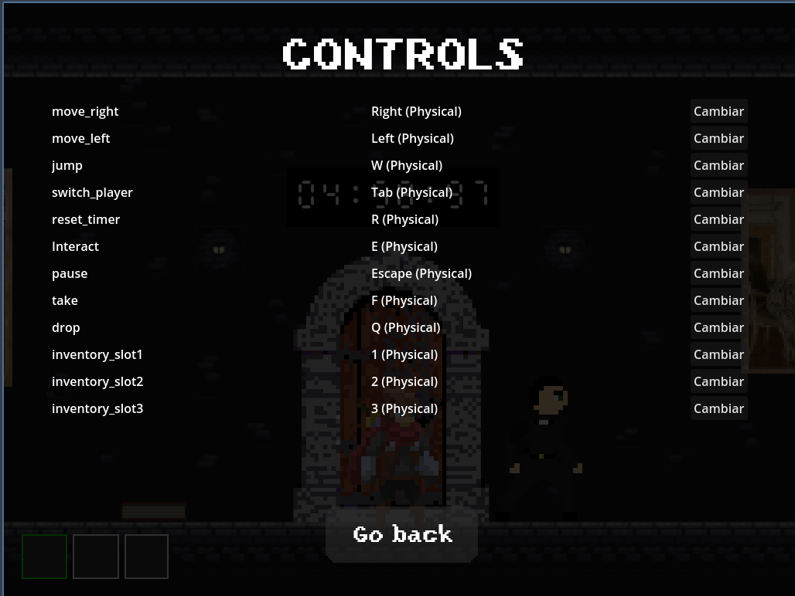
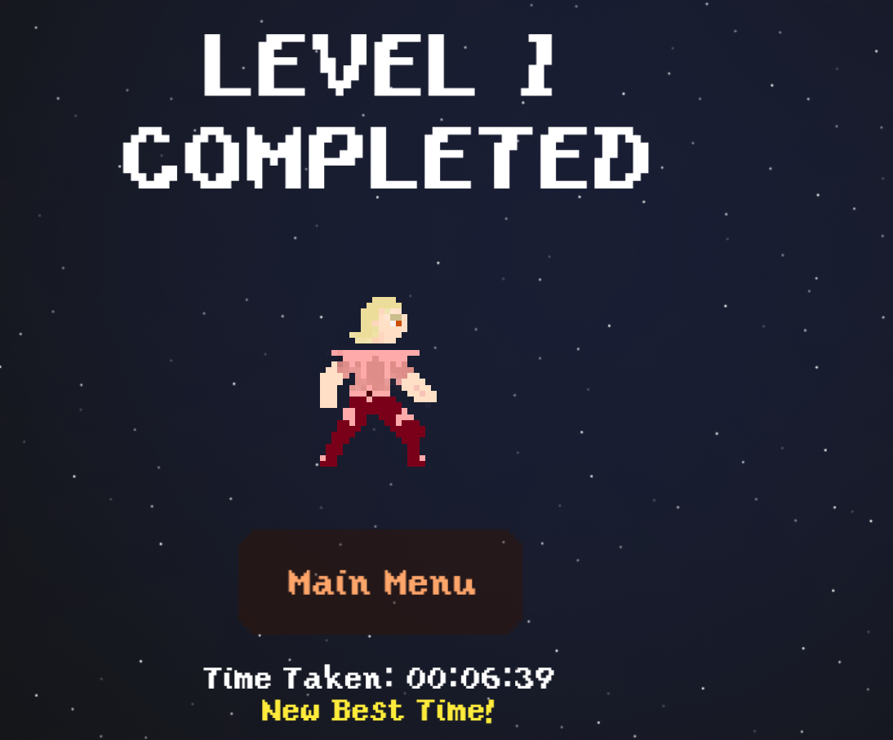
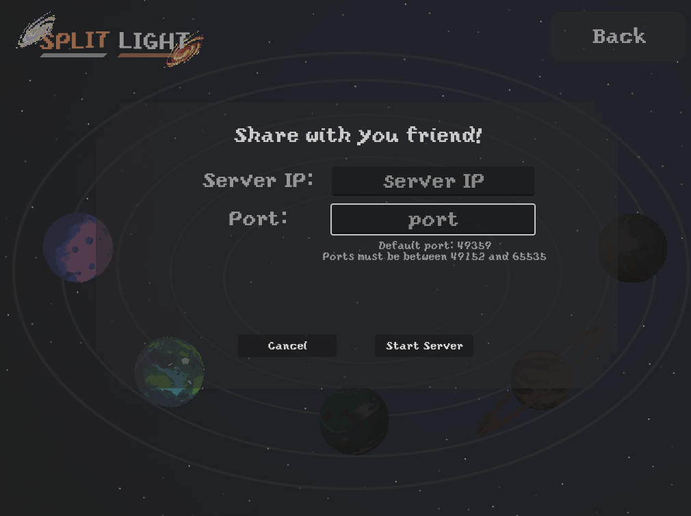
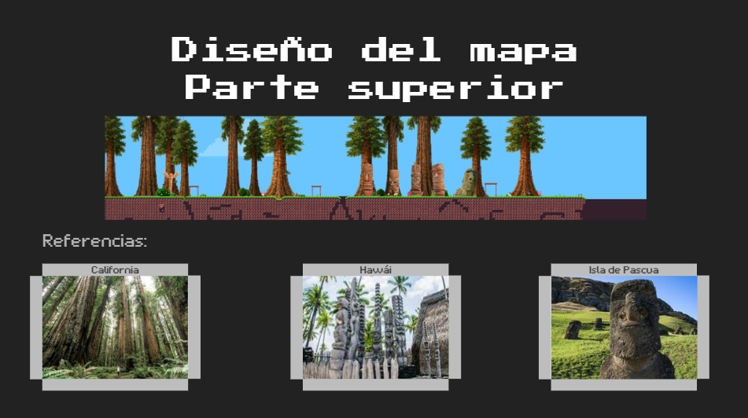
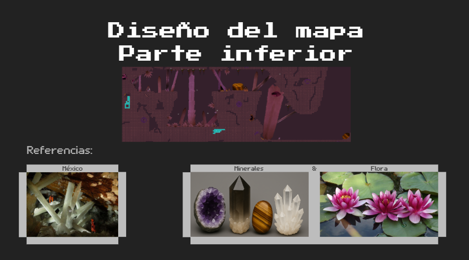
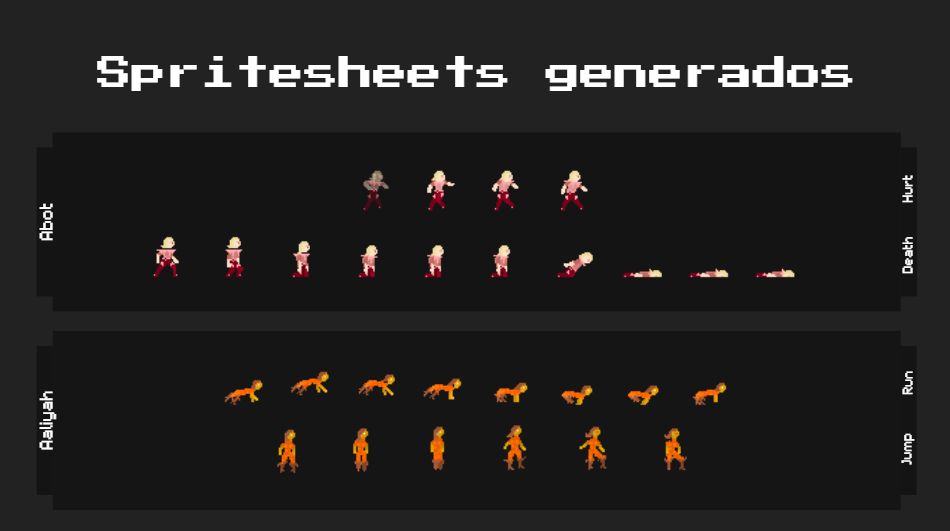
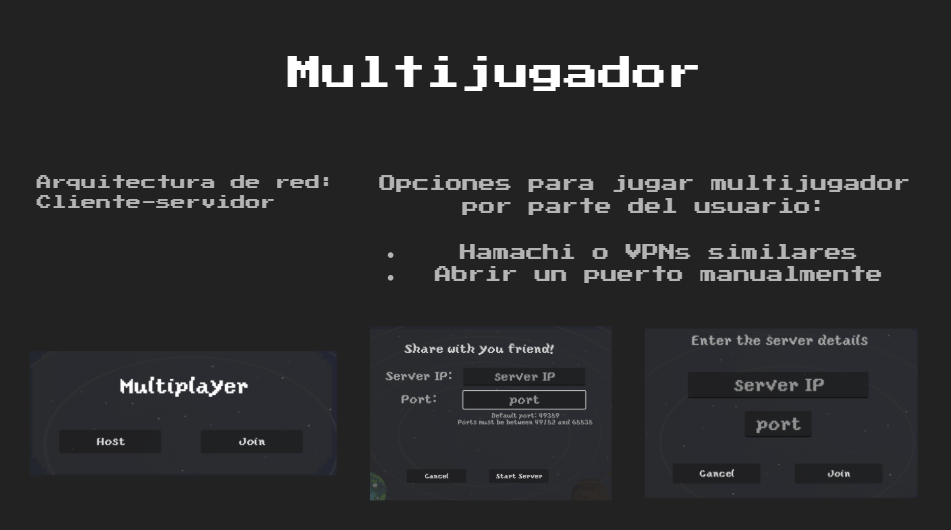

# Split Light

### An Escape-Room game where two linked characters race the clock across themed planets

## Table of Contents

- [Description](#description)
- [Screenshots](#screenshots)
- [Gameplay Preview](#gameplay-preview)
- [Behind the Scenes](#behind-the-scenes)
- [Controls](#controls)
- [Multiplayer](#multiplayer)
- [Design Boards](#design-boards)
- [Project Board](#project-board)
- [Tech Stack](#tech-stack)
- [Developers](#developers)
- [Acknowledgements](#acknowledgements)

## Description

Split Light is an Escape Room-style game in which two players possess unique
characteristics that are key to solving challenging puzzles within a maximum
time limit.

Navigate the Split Light universe, jumping between diverse planets with unique
themes alongside creative, challenging puzzles that require thinking outside
the box.

## Screenshots

<table>
<tr>
<td align="center" width="33%">
 
Controls menu
</td>
<td align="center" width="33%">
 
Level completed screen
</td>
<td align="center" width="33%">
 
Connecting to a co-op session
</td>
</tr>
</table>

## Gameplay Preview

📹 [Watch a short gameplay clip](docs/readme/video/gameplay-demo.mov) *(~10 MB,
opens in GitHub's file viewer)*

## Behind the Scenes

A look at how the game's art and systems came together during development.

<table>
<tr>
<td align="center" width="50%">
 
Map design — surface biome, inspired by California redwoods, Hawaiian
tikis and Easter Island moai
</td>
<td align="center" width="50%">
 
Map design — underground biome, inspired by Mexican cave crystals and
water lilies
</td>
</tr>
<tr>
<td align="center" width="50%">
 
Generated spritesheets for both playable characters
</td>
<td align="center" width="50%">
 
Multiplayer client-server architecture and connection flow
</td>
</tr>
</table>

## Controls

| Action | Key |
| --- | --- |
| Move left / right | `Left` / `Right` arrow |
| Jump | `W` |
| Switch player | `Tab` |
| Interact | `E` |
| Take / Drop item | `F` / `Q` |
| Inventory slots 1-3 | `1` `2` `3` |
| Reset timer | `R` |
| Pause | `Escape` |

All bindings above are remappable in-game from the Controls menu.

 

## Multiplayer

Split Light supports co-op play over a **client-server** network
architecture: one player hosts the session and the other joins with the
host's IP and port.

Since the game isn't hosted on dedicated servers, playing with a friend
remotely requires one of:

- A virtual LAN tool such as [Hamachi](https://vpn.net/), or
- Manually forwarding a port on the host's router (default port `49359`,
  range `49152`-`65535`)

## Design Boards

All designs and mockups made so far, from complete screens to individual
elements.

## Project Board

The complete task log to date, with all pending features to develop, those in
progress, and those ready for production.

## Tech Stack

This project is built with [Godot 4.4](https://godotengine.org/), a game
engine with extensive capabilities for 2D games and broad support for 3D.

Godot has its own programming language (GDScript), which is easy to learn,
with a low learning curve, and capable of providing a fast workflow in a short
time.

## Developers

- Meng Fei Dai
- Félix Miguel Velásquez
- Daniel Gutiérrez Recio
- Mario García Abellán
- Juan Carlos Rodríguez Ramírez
- Ian Samuel Trujillo Gil

## Acknowledgements

- Planet Generation: [PixelPlanets](https://deep-fold.itch.io/pixel-planet-generator)
- Godot Game Engine: [Godot](https://godotengine.org/)
- Isometric TileSets: [Isometric TileSets](https://scrabling.itch.io/pixel-isometric-tiles)
